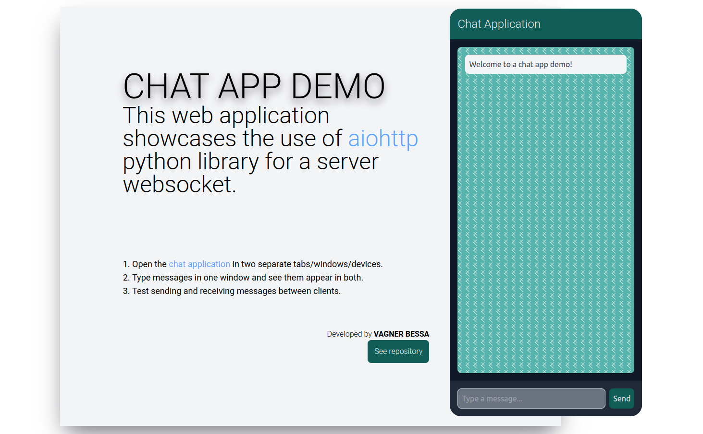

# Chat Application Demo

See demo website: [https://sample-chat.onrender.com/](sample-chat.onrender.com/)



## Overview

This is a simple chat application demonstration built using Python with the aiohttp framework and HTML/CSS/JavaScript. The application allows real-time communication between users through WebSockets.

## Features

- Real-time messaging between connected users
- Responsive web design
- Customizable styling with Tailwind CSS
- Docker containerization for easy deployment

## Setup

### Prerequisites

- Python 3.12+
- Node.js and npm
- Docker

### Installation

1. Clone the repository:

```
git clone https://github.com/yourusername/chat-application.git cd chat-application
```
2. Install dependencies:

2.1 Python packages

* via pip:
```
pip install -r requirements.txt
```

* via poetry

```
poetry install
```

2.2 CSS framework:

```
npm install -D tailwindcss
```

3. Build static assets:

```
npx tailwindcss -i ./src/input.css -o ./src/output.css
```

Alternatively (linux users) you can use the [build.sh](build.sh) file to set up this application.

## Running the Application

### Development Mode

Run the application using Python:

```
python app.py
```

Open a browser and navigate to `http://localhost:8080`.

### Production Mode

Build the Docker image:

```
docker build -t chat-app .
```

Run the Docker container:

```
docker run -d -p 8081:8080 chat-app
```
Access the application at `http://localhost:8081`.

## Usage

1. Open the chat application in two separate tabs/windows/devices.
2. Type messages in one window and see them appear in both.
3. Test sending and receiving messages between clients.

## Contributing

Contributions are welcome! Please feel free to submit issues or pull requests.

## License

This project is licensed under the MIT License - see the [LICENSE.md](LICENSE.md) file for details.
